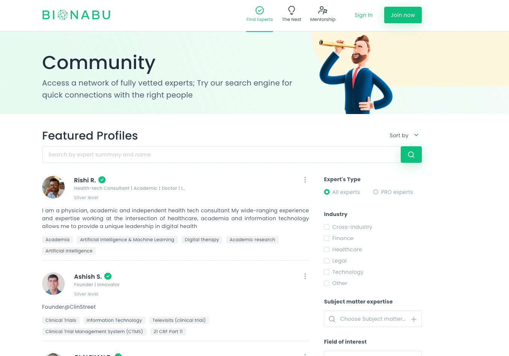
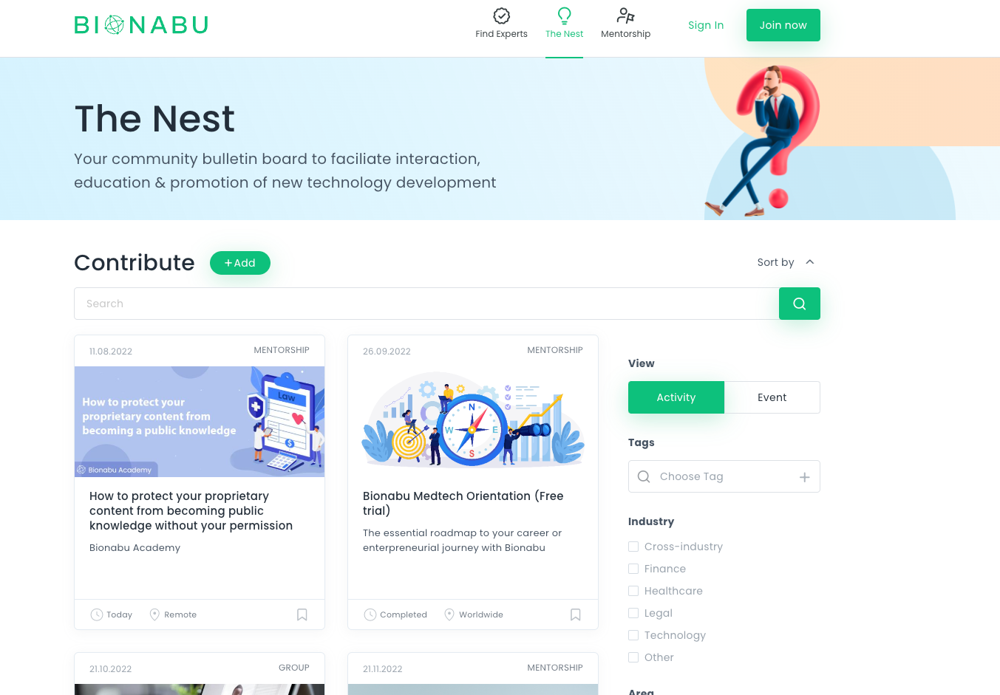
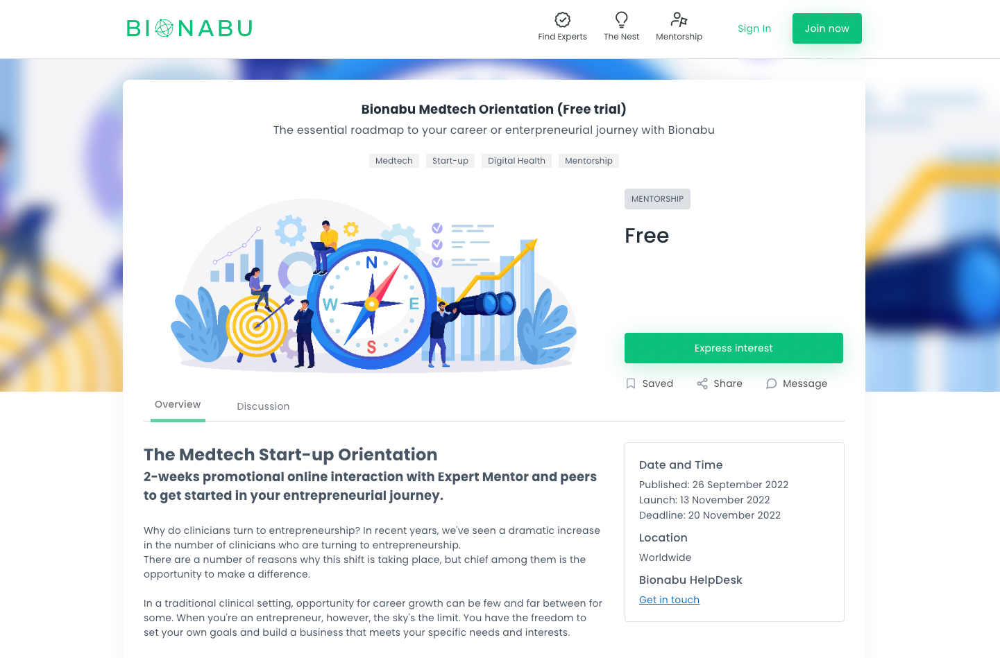
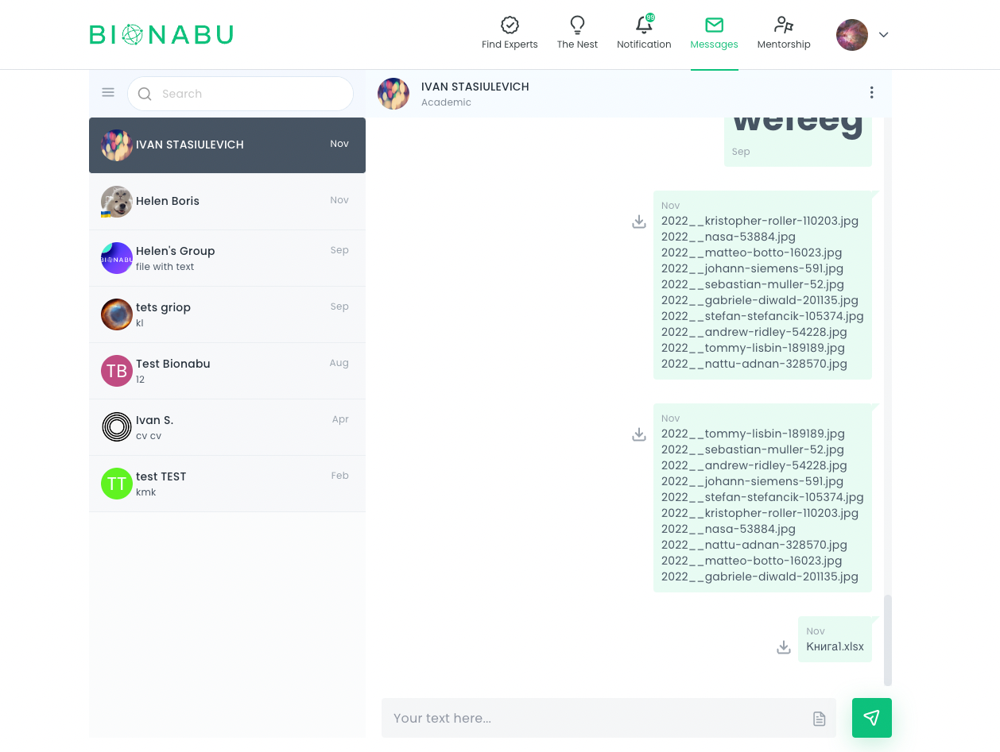

# Bionabu

### Описание
Bionabu - онлайн площадка, где каждый может найти экспертов, ответы на вопросы, принять участие в различных митапах (как слушатель, так и в роли эксперта).

#### [Bionabu](https://www.bionabu.com/)

### Основной стек (frontend)

- react
- mobx
- semantic-ui
- react-hook-forms
- yup
- react-draft-wysiwyg
- websockets

### Примеры скриншотов приложения

  
Смотреть больше

