# Lanit

I've worked in department of analytical system of control activity with several modules:

#### [Go to dashboards](#dashboards)
#### [Go to requests list](#requests-list)
#### [Go to monitoring of interactions](#monitoring-of-interactions)

## Dashboards

### Description
Service for generating reports(charts and tables) which is covering all controls activities

Service has filters by dates, departments and other parameters. Also, it compares graphics in order to different dates or organizations.
Groups of widgets or specific widgets are possible to export in pdf-file as well. 

### Main stack (frontend)

- react
- recharts
- pdfkit
- mobx

### Screenshots

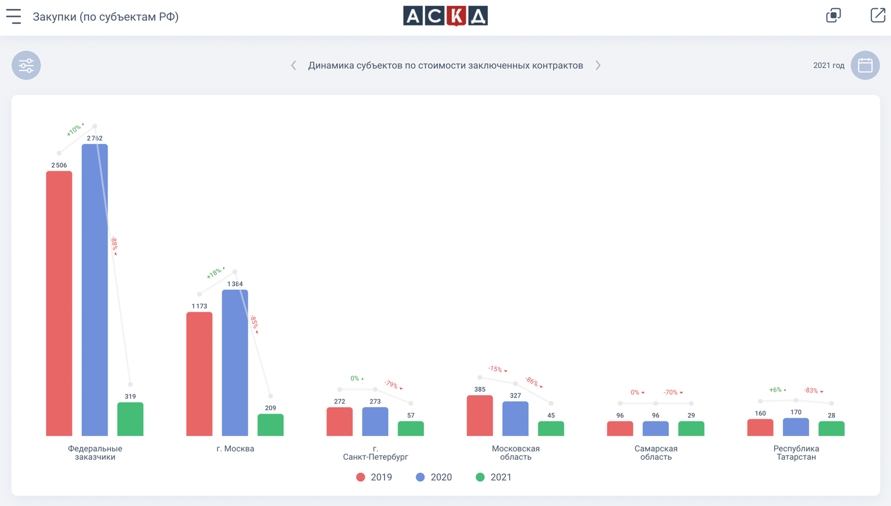

  
See more

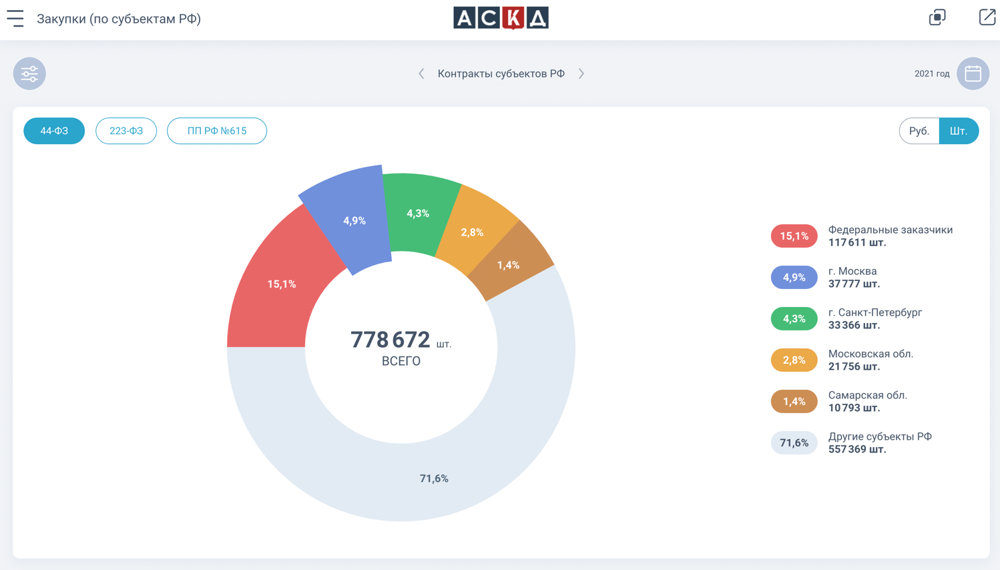
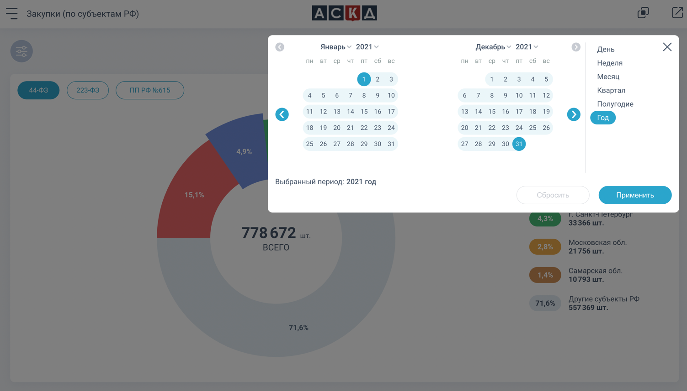
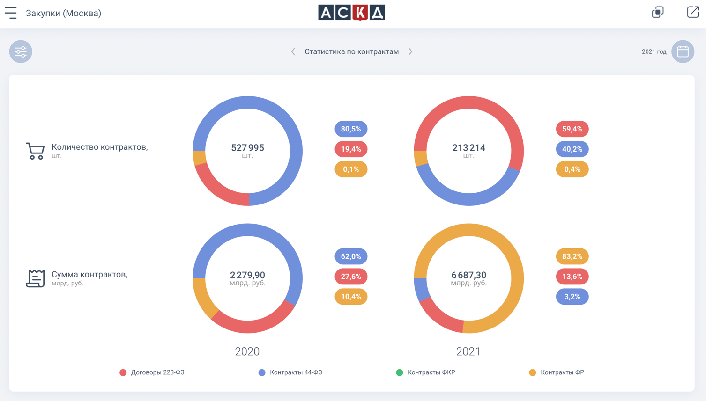
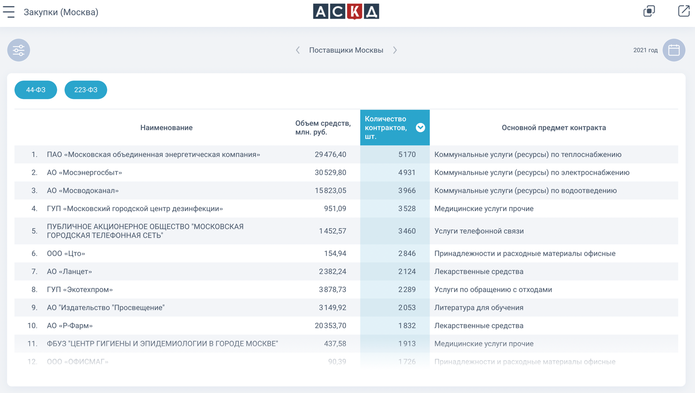
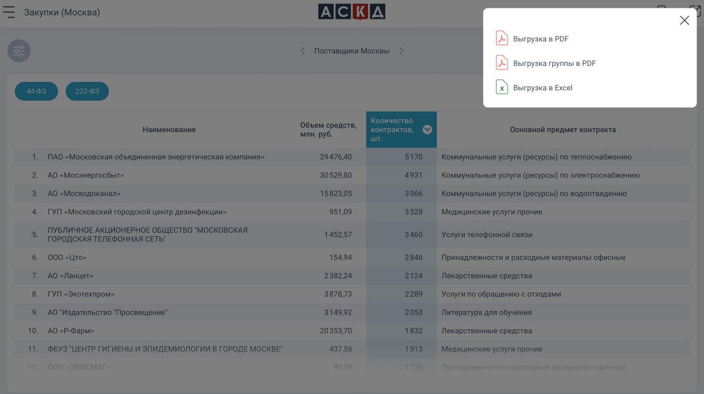
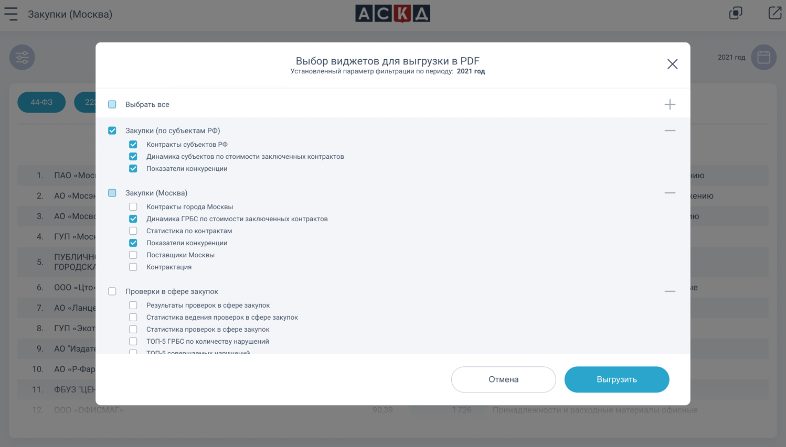

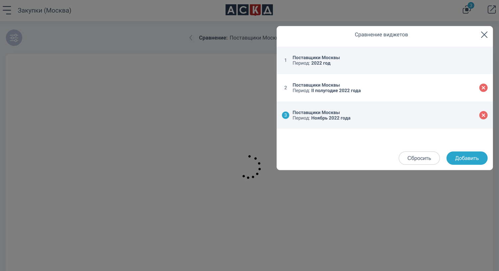
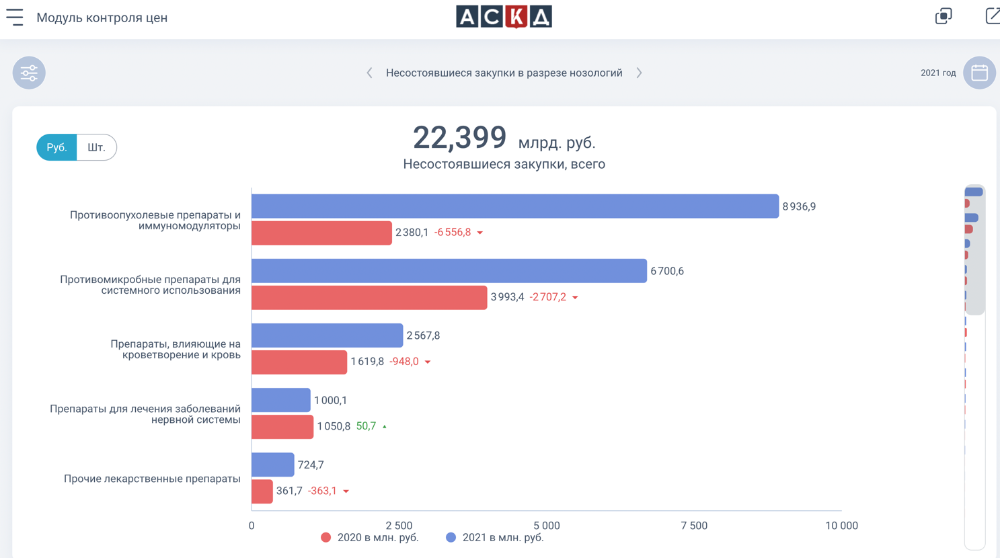
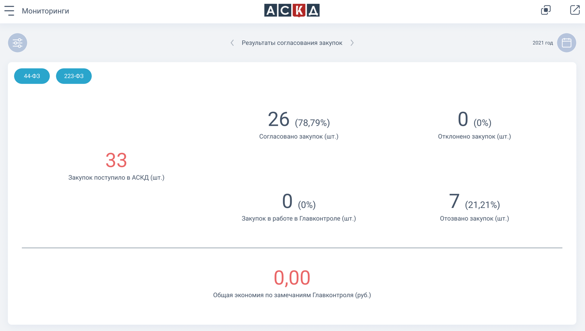

## Requests list

### Description
Service aggregates and stores data about requests from Rosfinmonitoring and inspection results via customers, carriers, 
entrepreneurs or individual persons.

### Main stack (frontend)

- react
- typescript
- mobx
- antd
- react-hook-form
- yup
- react-day-picker

### Screenshots

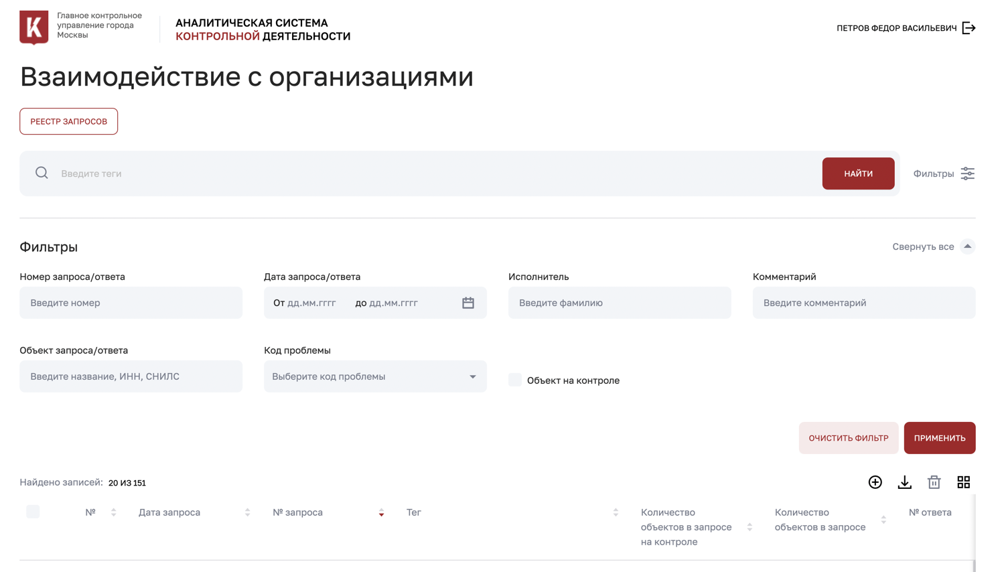

  
See more

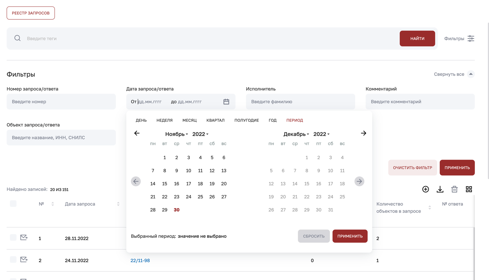
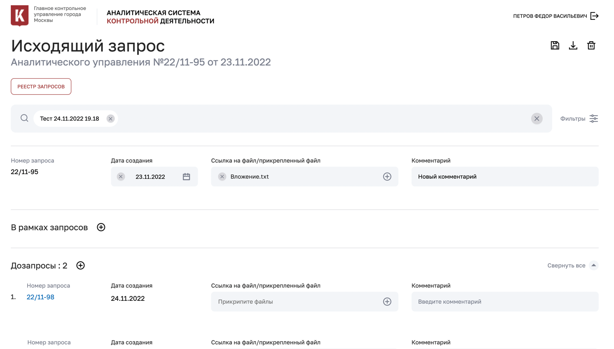
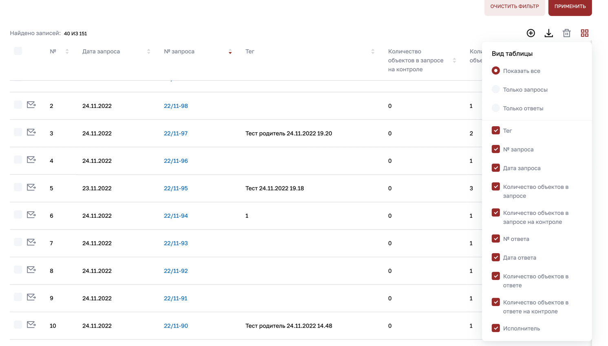
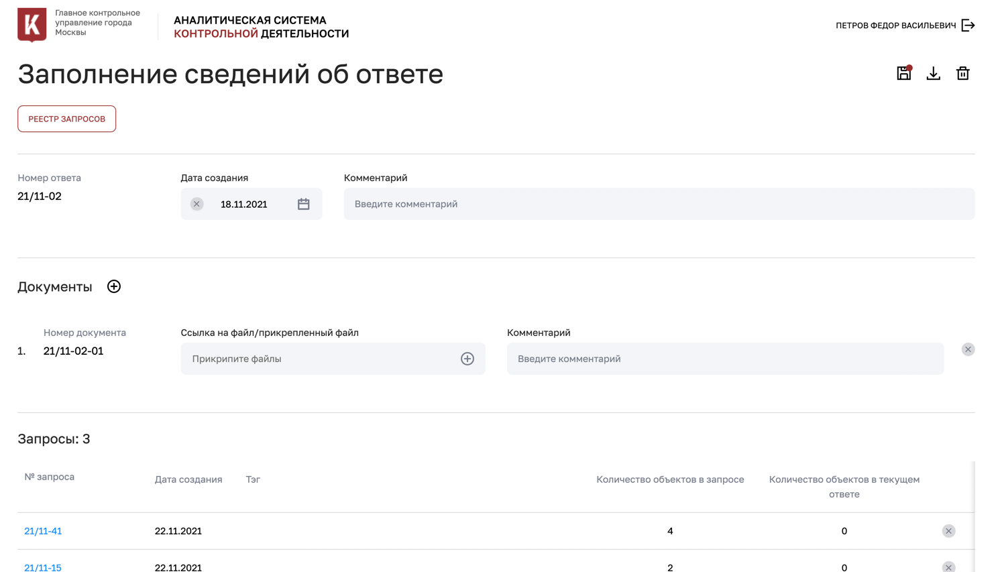

## Monitoring of interactions

### Description
Service creates dependencies between different types of subjects. There are graphs which can be changed with layouts or hide/disclosure
extra dependencies.

### Main stack (frontend)

- react
- typescript
- mobx
- antd
- @antv/g6

### Screenshots 

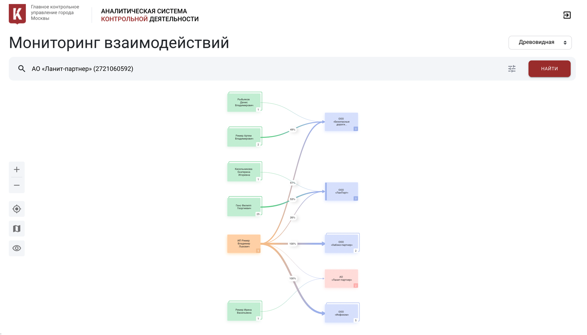

  
See more

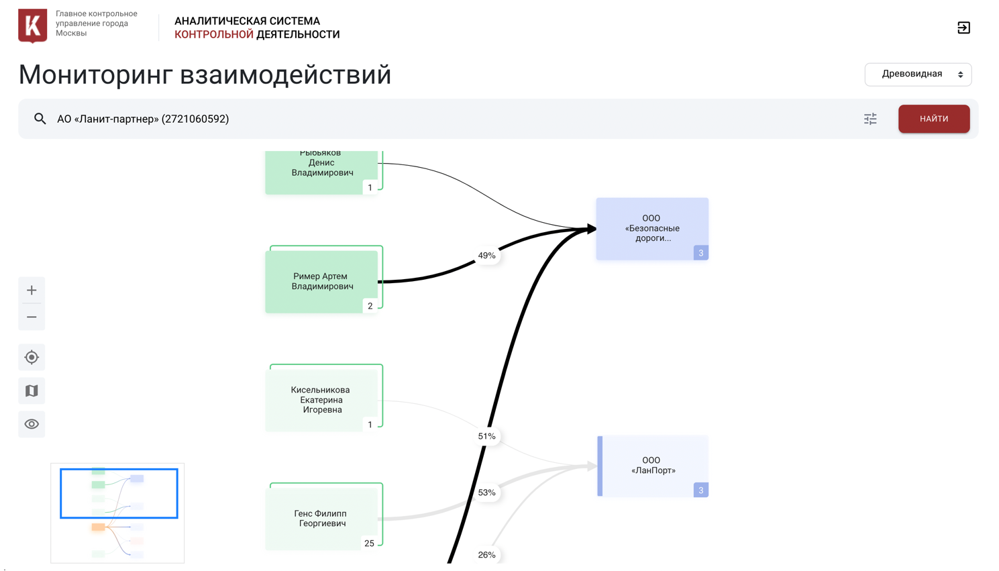
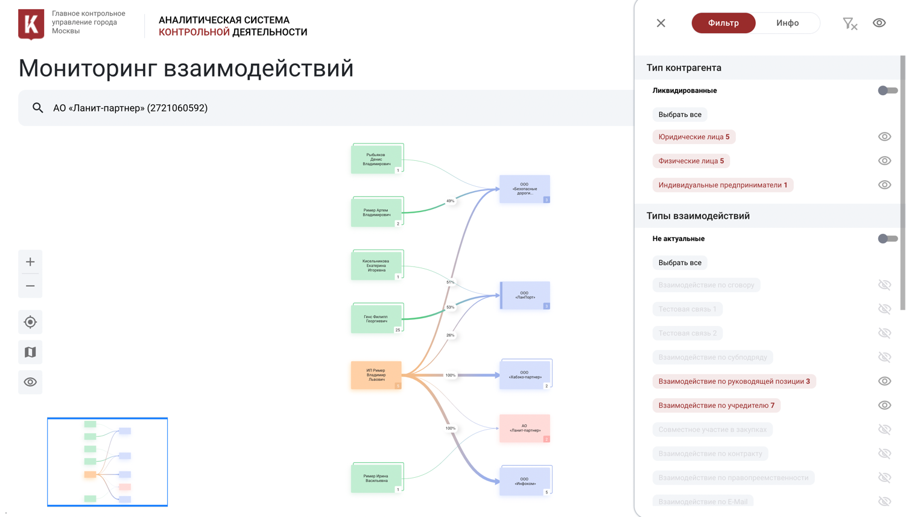

