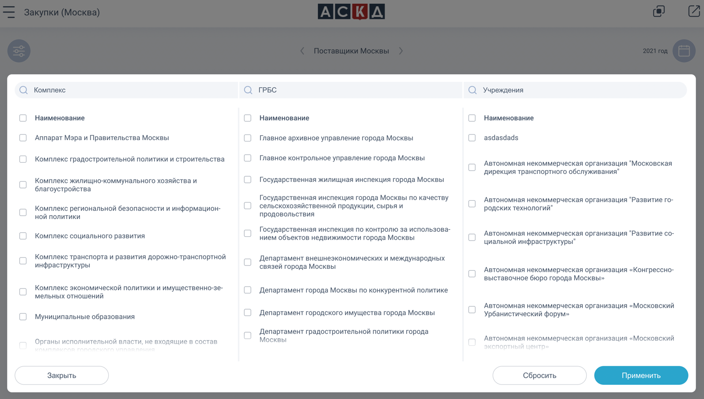

# Ланит

В Ланите в подразделении аналитической системе контрольной деятельности работал над несколькими модулями:

#### [Перейти к дашбордам](#дашборды)
#### [Перейти к реестру запросов](#реестр-запросов)
#### [Перейти к мониторингу взаимодействия](#мониторинг-взаимодействия)

## Дашборды

### Описание
Сервис для просмотра отчетов по всем системам контрольной деятельности в виде графиков и таблиц.

Для удобства имеется фильтрация по периоду, по учреждениям и другим параметрам. Присутствует возможность сравнивать графики в рамках разных периодов и разных организаций. Также присутствует возможность выгрузить отчеты в pdf-файл группы виджетов или отдельных виджетов

### Основной стек (frontend)

- react
- recharts
- pdfkit
- mobx

### Примеры скриншотов приложения

  
Смотреть больше

## Реестр запросов

### Описание
Сервис для агрегированного и стандартизированного хранения сведений о запросах из Росфинмониторинга и результатов проверок по заказчикам, поставщикам, индивидуальным предпринимателям и физическим лицам.

### Основной стек (frontend)

- react
- typescript
- mobx
- antd
- react-hook-form
- yup
- react-day-picker

### Примеры скриншотов приложения

  
Смотреть больше

## Мониторинг взаимодействия

### Описание
Сервис для построения связей взаимодействий между различными типами субъектов. Отображаются в виде графа, с возможностью изменения сетки отображения и раскрытия/скрытия дополнительных связей

### Основной стек (frontend)

- react
- typescript
- mobx
- antd
- @antv/g6

### Примеры скриншотов приложения

  
Смотреть больше

