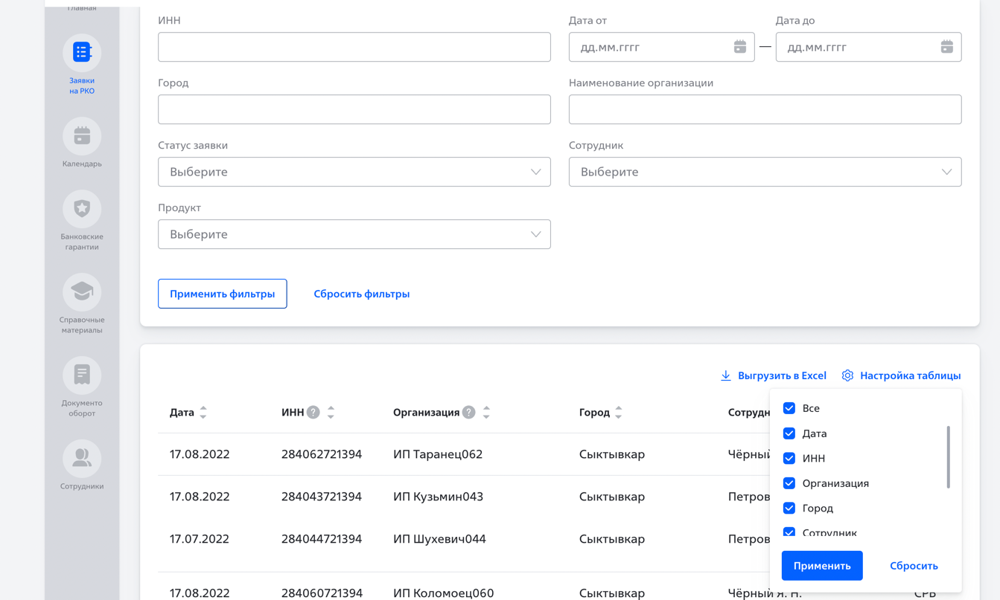

# VTB

### Description
Account for agents and partners

### Main stack (frontend)

Built via microfrontends. Was used module federation by webpack

- react
- typescript
- mobx
- ui-kit
- xlsx
- d3js
- husky
- lint-staged

### Screenshots

  
See more

